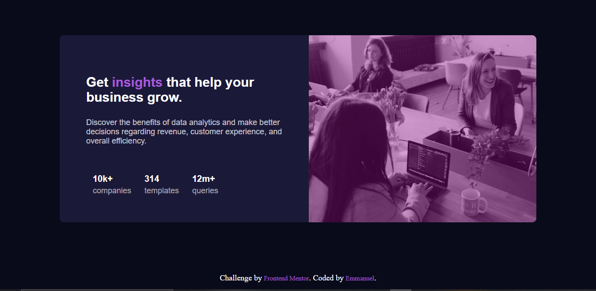
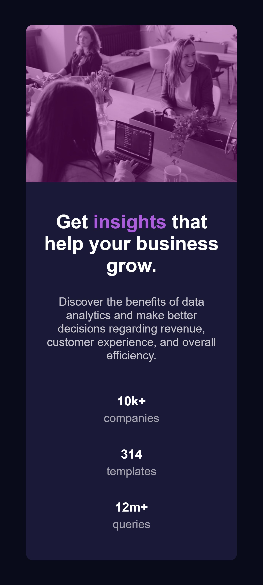

# Frontend Mentor - Stats preview card component solution

This is a solution to the [Stats preview card component challenge on Frontend Mentor](https://www.frontendmentor.io/challenges/stats-preview-card-component-8JqbgoU62). Frontend Mentor challenges help you improve your coding skills by building realistic projects. 

## Table of contents

- [Overview](#overview)
  - [The challenge](#the-challenge)
  - [Screenshot](#screenshot)
  - [Links](#links)
- [My process](#my-process)
  - [Built with](#built-with)
  - [Continued development](#continued-development)
- [Author](#author)

**Note: Delete this note and update the table of contents based on what sections you keep.**

## Overview

### The challenge

Users should be able to:

- View the optimal layout depending on their device's screen size

### Screenshot

### Links

- Solution URL: [https://github.com/munyite001/Stats-Preview-card-component](https://github.com/munyite001/Stats-Preview-card-component)
- Live Site URL: [stats-preview-frm.netlify.app](stats-preview-frm.netlify.app)

## My process
Started with modible design, then worked my way towards the deskop design

### Built with

- Semantic HTML5 markup
- CSS custom properties
- Flexbox

### Continued development

I want to continue improving on the Accessibility issues in order to improve on my design

## Author

- Github - [@munyite002](https://github.com/munyite001)
- Frontend Mentor - [@munyite001](https://www.frontendmentor.io/profile/munyite001)
- Twitter - [@emunyite](https://www.twitter.com/emunyite)
